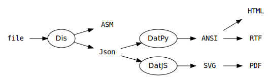
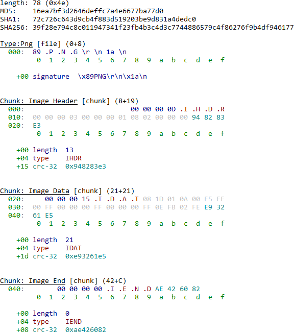
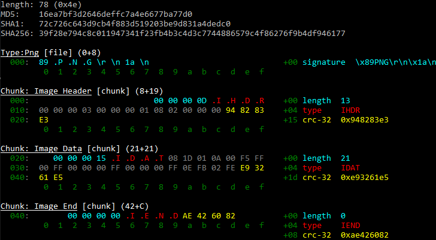
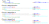
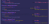

# SBuD

SBuD is an **experimental playground** related to file formats parsing and visualization.

It's *merely a suggestion* at this stage - its design and code could change at any time (it's at least its 3rd iteration).
Don't expect a working tool yet.

SBuD is made of 2 types of components, Dis and Dat, which can work together but are not required to each other.

<!--
digraph {
  rankdir=LR;
  node [shape=none,fontname=monospace];
  file;
  ASM;
  Json;
  PDF;
  HTML;
  SVG;
  RTF;
  ANSI;

  node [shape=oval, fontname="Arial Black"];
  file -> Dis;
  Dis -> ASM;
  Dis -> Json;
  Json -> "DatPy"-> ANSI -> HTML;
  Json -> "DatJS" -> SVG -> PDF;
  ANSI -> RTF;
}
-->



## Dis (-sector/sassembler)

Parses input files to:
- generate JSON for visual representation via Dat.

```
{
 "fileName": "rgb.png", 
 "length": 78, 
 "struc": {
  "name": "Type:PNG", 
  "offset": 0, 
  "subEls": [
   {
    "ASCII": true, 
    "name": "signature", 
    "offset": 0, 
    "size": 8, 
    "type": "magic", 
    "value": "\\x89PNG\\r\\n\\x1a\\n"
   }, 
[...]
```

- generate Assembly source to rebuild the file via Nasm/Yasm.

```
db `\x89PNG\r\n\x1a\n`                            ; signature                    ;0000: 89 50 ..... 1a 0a (+8)

chunk1:                                           ; chunk1 { //Image Header
 ddbe 13                                          ;  length                      ;0008: 00 00 00 0d (+4)
;ddbe (chunk1.crc32 - chunk1.data)

.type db `IHDR`                                   ;  type                        ;000c: 49 48 44 52 (+4)

.data:                                            ; Data {
  incbin 'rgb.png', 0x10, 0xd                                                    ;0010: 00 00 ..... 00 00 (+13)
  ;}                                              ;   } //Data

.crc32 ddbe 0x948283e3                            ;  crc-32                      ;001d: 94 82 83 e3 (+4)
 ;> chunk1.crc32=CRC32(chunk1.type,chunk1.crc32)
;}                                                ; } //chunk

[...]
```


## Dat(-a visualizer)

Exists in 2 flavors:
- DatPy exports to ANSI text, which can then be converted to HTML (to paste in web forms), RTF (to paste in Office Files) or TeX via tools like [AnsiFilter](http://www.andre-simon.de/doku/ansifilter/en/ansifilter.php)



*light in narrow mode*



*dark in wide mode*

- DatJS is relying on [Albert](https://github.com/evoL/albert) to render SVG in the browser. It can be converted to PDF.




*light Ansi theme*



*Shades of Purple theme*